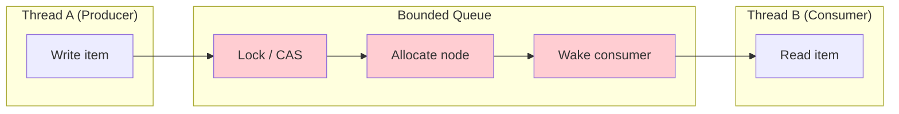
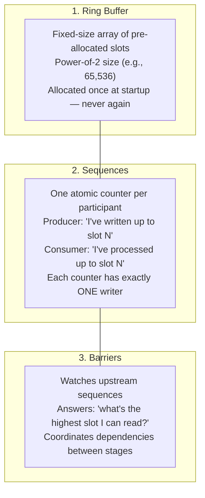
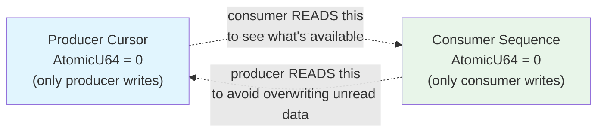
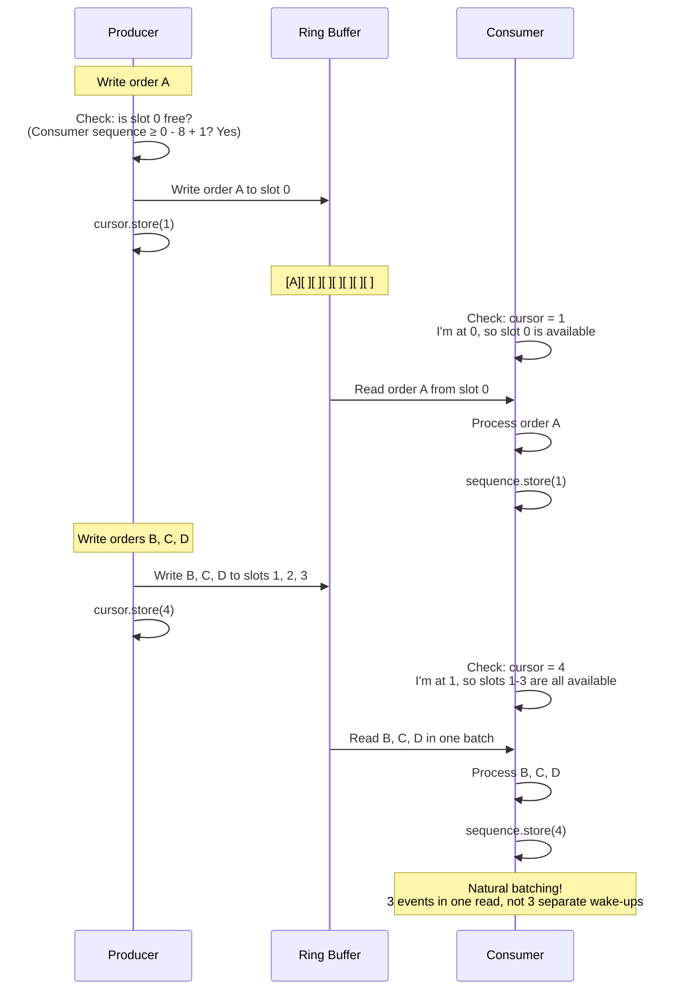
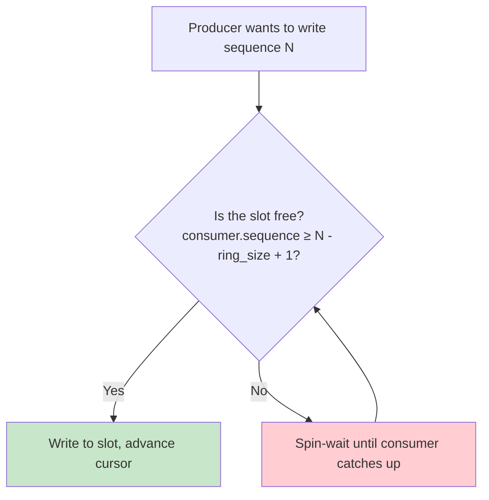
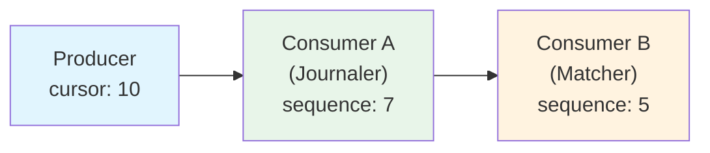
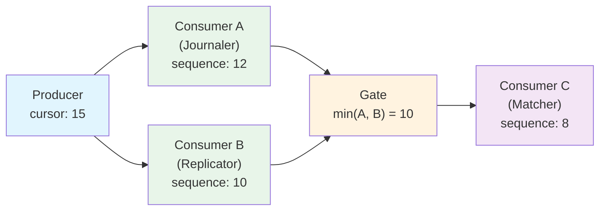

# The LMAX Disruptor

We're building the matching engine for a Central Limit Order Book (CLOB) exchange. The matching engine has one job: take incoming orders and match them against the order book as fast as possible.

Internally, this means passing data between threads at extremely high rates. An order arrives on a network thread, gets journaled for durability, replicated for fault tolerance, matched against the book, and the results are sent back to the client and published to market data feeds. That's at least 5 stages — and each one runs on a different thread.

The standard way to pass data between threads is a **queue** — whether it's called a "channel" (`mpsc::channel` in Rust, `chan` in Go) or a "blocking queue", the underlying primitive is the same: a thread-safe buffer with `send`/`recv` semantics, head/tail pointers, and contention on shared state. Queues work fine for most applications. But when you need to process millions of messages per second with single-digit microsecond latency, they become the bottleneck.

We found the [LMAX Disruptor](https://lmax-exchange.github.io/disruptor/) — a pattern invented by LMAX Exchange that solves exactly this problem elegantly. It replaced our inter-thread queues and delivered **much lower latency** per message.

This post explains what the Disruptor is, why it's fast, and how it works — from first principles.

---

## Why Queues Are Slow

Before understanding the Disruptor, you need to understand what's wrong with queues. Three things happen on every single message:



### 1. Contention and False Sharing

Some queues use locks (mutexes on head/tail), others use lock-free CAS (compare-and-swap). CAS is faster than locks, but **both** suffer from the same underlying hardware problem: the producer and consumer write to memory locations that live on the same CPU cache line (64 bytes).

When the producer writes `head`, the CPU invalidates the consumer's cached copy of that cache line. When the consumer writes `tail`, it invalidates the producer's copy. This is called **false sharing** — two threads bouncing a cache line back and forth between CPU cores. It doesn't matter whether the write uses a mutex or a CAS — the cache invalidation cost is the same.

```
Queue internal state — ALL on the same cache line:
┌───────────────────────────────────┐
│ head: 42  ← producer writes here  │
│ tail: 37  ← consumer writes here  │
│ count: 5  ← BOTH read this        │
└───────────────────────────────────┘
Lock or CAS — doesn't matter.
Every write by one thread invalidates the other's cache.
```

CAS adds another problem: under contention, a CAS can fail and must retry. With multiple producers competing to update the same counter, the retry count becomes unpredictable — making latency non-deterministic.

### 2. Memory Allocation

Linked-list queues allocate a new node on every enqueue and free it on every dequeue. Each allocation has a cost, plus memory fragmentation causes cache misses, plus GC pressure in managed languages.

### 3. Kernel Involvement

When the consumer has no data to process, it has two choices: burn CPU in a busy loop, or go to sleep and wait for a wake-up signal. The wake-up path goes through the kernel scheduler — a syscall plus a context switch, which is orders of magnitude slower than a user-space operation.

**The Disruptor eliminates all three.**

---

## What the Disruptor Is

The Disruptor is a **pre-allocated ring buffer** with **sequence-based coordination**. It replaces queues for inter-thread communication.

It is **not** a queue. There's no enqueue/dequeue. No send/receive. No locks on the hot path. It's a fundamentally different primitive.

It has three components:



Let's understand each one through examples.

---

## Example 1: One Producer, One Consumer

The simplest case. A network thread produces order events. A processing thread consumes them.

### The Ring Buffer

Imagine an array of 8 slots (LMAX used 20 million for their input disruptor):

```
Index:    0     1     2     3     4     5     6     7
        ┌─────┬─────┬─────┬─────┬─────┬─────┬─────┬─────┐
Slots:  │     │     │     │     │     │     │     │     │
        └─────┴─────┴─────┴─────┴─────┴─────┴─────┴─────┘
```

Every slot is **pre-allocated at startup**. No `malloc` ever happens again. The producer doesn't "add" items to the ring — it **overwrites** pre-existing slots. The consumer doesn't "remove" items — it **reads** them in place.

The ring uses a **sequence number** that increases forever (0, 1, 2, 3, ...). To find which slot a sequence maps to:

```
slot_index = sequence & (ring_size - 1)
```

This is a bitwise AND — much faster than modulo division. It's why the ring size must be a power of 2. Sequence 8 wraps around to index 0, sequence 9 to index 1, and so on.

### The Sequences

Two atomic counters — one for the producer, one for the consumer:



**This is the key insight.** Each counter has exactly one writer. An atomic store to a single-writer variable never contends — it always succeeds in one operation. Compare this to a queue's CAS (compare-and-swap), which can fail and retry unpredictably.

### Step-by-Step



**Notice the natural batching.** The consumer doesn't read one event at a time — it reads all events between its current position and the producer's cursor. Under high load, the producer writes many events while the consumer processes one batch. The next time the consumer checks, there are many events waiting. Batch size **adapts automatically to load** — no tuning needed.

### What About Wrapping?

When the producer reaches the end of the ring, it wraps around:

```
After writing 8 events (A through H):

  Sequence:  8     1     2     3     4     5     6     7
  Index:     0     1     2     3     4     5     6     7
           ┌─────┬─────┬─────┬─────┬─────┬─────┬─────┬─────┐
           │  I  │  B  │  C  │  D  │  E  │  F  │  G  │  H  │
           └─────┴─────┴─────┴─────┴─────┴─────┴─────┴─────┘
           ↑
           Sequence 8 → index 0 (8 & 7 = 0) → overwrites slot 0
```

But what if the consumer hasn't read slot 0 yet? The producer checks before overwriting:



This is **natural back-pressure** — if the consumer falls behind, the producer waits. No data is ever lost, and no unread data is ever overwritten.

---

## Example 2: Pipeline — A Then B

Real systems have multiple processing stages. In a pipeline, Consumer B can only process events **after** Consumer A finishes.

Think of: journaling an order to disk (A), then matching it against the order book (B). You don't want to match an order that hasn't been durably saved yet.



The coordination is trivially simple:

- **Consumer A's barrier** watches the producer's cursor → A can read up to slot 9.
- **Consumer B's barrier** watches Consumer A's sequence → B can read up to slot 6.
- **Producer's wrap check** watches Consumer B's sequence (the furthest behind) → ensures no overwriting.

No locks. No coordination protocol. Just each participant reading an upstream atomic counter.

**Both consumers read from the same ring buffer.** No data is copied between stages. Consumer B reads the exact same memory slots that Consumer A read — zero-copy, no allocation, no serialization.

---

## Example 3: Diamond — Parallel Stages With a Gate

This is the Disruptor's most powerful pattern and the one we use in our matching engine's order processing pipeline.

The scenario: an incoming order must be **journaled to disk** AND **replicated to a follower** before the matching engine processes it. Journaling and replication can happen in parallel — but matching must wait for **both** to complete.



The magic is the **gating barrier**. Consumer C's barrier watches **both** A and B, and returns the minimum:

```
Consumer A (Journaler): sequence = 12      ← fast (local disk)
Consumer B (Replicator): sequence = 10     ← slower (network round-trip)

Gating barrier: min(12, 10) = 10

Consumer C (Matcher): can process up to slot 9
```

Consumer C only proceeds when **both** journaling and replication are confirmed. But A and B run fully in parallel — the fast one doesn't wait for the slow one.

**All three consumers read from the same ring buffer.** The same order bytes flow through journaling, replication, and matching without a single copy. The only thing that moves between threads is an integer (the sequence number).

---

## Why It's Fast

The Disruptor isn't fast because of clever algorithms. It's fast because of **mechanical sympathy** — designing software that works *with* the hardware rather than against it.

### 1. No False Sharing

```
Traditional queue:                    Disruptor:
┌─────────────────────────┐          ┌─────────────────────────┐
│ Cache Line (64 bytes)   │          │ Cache Line 0 (64 bytes) │
│ head ← producer writes  │          │ producer_cursor         │
│ tail ← consumer writes  │          │ _padding: [u8; 56]      │
│ count ← both read       │          └─────────────────────────┘
└─────────────────────────┘          ┌─────────────────────────┐
  ↕ bounces between cores            │ Cache Line 1 (64 bytes) │
  (slow — cross-core                 │ consumer_sequence       │
   cache invalidation)               │ _padding: [u8; 56]      │
                                     └─────────────────────────┘
                                       Each stays in its own L1 cache
                                       (fast — no invalidation)
```

Each sequence counter is padded to its own 64-byte cache line. No thread ever writes to another thread's cache line. No invalidation, no bouncing.

### 2. Sequential Memory Access

Ring buffer slots are contiguous in memory. When the consumer reads slot 0, the CPU prefetcher automatically loads slots 1, 2, 3 into L1 cache. By the time the consumer reaches them, they're already cached.

Compare to a linked-list queue where nodes are scattered across the heap — every access is a cache miss, and the prefetcher is useless.

### 3. No Locks, No CAS (Single-Producer Mode)

```
Queue (per message):
  CAS(head, old, new)     → may fail, must retry under contention
  Cost: unpredictable

Disruptor single-producer (per message):
  cursor.store(N, Release) → always succeeds, one instruction
  Cost: deterministic, significantly cheaper
```

### 4. Zero Allocation

The ring is allocated once at startup. Every subsequent operation reads and writes pre-existing memory. No `malloc`, no `free`, no GC pause, ever.

### Combined Effect

These four properties compound. A queue pays lock/CAS + allocation + kernel wake-up on every message — costs that are individually small but add up to microseconds under load. The Disruptor replaces all of that with a single atomic store (the cursor advance) and a single atomic load (the barrier check). Everything else is plain memory reads and writes to pre-cached, contiguous slots.

**50-200x faster per message.** The official LMAX benchmarks bear this out — on a 3-stage pipeline, the Disruptor achieves a mean latency of 52 nanoseconds per hop compared to 32,757 nanoseconds for `ArrayBlockingQueue` (~630x).

---

## The Wait Strategy: What Happens When There's No Data

When the consumer has caught up with the producer and there's nothing to read, it needs to wait. The Disruptor uses a **three-phase wait strategy** that adapts to load:

| Phase | Action | Latency | CPU cost |
|-------|--------|---------|----------|
| **1. Spin** | Busy-loop checking the sequence | Lowest — data seen immediately | High — burns a core |
| **2. Yield** | Give up the timeslice, re-check on next schedule | Low | Moderate |
| **3. Park** | Sleep until woken | Higher — kernel round-trip | Near zero |

The same strategy applies to the **producer**. When the ring is full and the slowest consumer hasn't caught up, the producer must wait before it can overwrite a slot. It uses the same spin → yield → park progression, back-pressuring the upstream source until consumers drain the ring.

---

## When to Use It (and When Not To)

The Disruptor is not a general-purpose replacement for channels. Use it when:

- You need **sub-microsecond latency** between threads.
- You have a **single producer** per data stream.
- You need **multiple consumers** reading the same data (fan-out without copying).
- You need **natural batching** that adapts to load.
- You're willing to accept more complex setup for dramatically better performance.

Don't use it when:

- Latency doesn't matter and simplicity does (just use a channel).
- Your messages are very large or variable-sized (the ring works best with fixed-size slots).

**A note on multiple producers:** The Disruptor *does* support multi-producer mode — producers use CAS to claim sequences, then busy-spin to commit in order. This is still faster than a traditional queue (no allocation, no kernel involvement, pre-allocated ring), but you lose the zero-contention property of single-producer mode. For maximum performance, prefer one ring per producer.

---

## References

- [A minimal Rust implementation of the LMAX Disruptor for this post.](https://github.com/logan272/disruptor-rs)
- [LMAX Disruptor Technical Paper (Martin Thompson)](https://lmax-exchange.github.io/disruptor/disruptor.html)
- [Mechanical Sympathy Blog (Martin Thompson)](https://mechanical-sympathy.blogspot.com/)
- [LMAX Architecture (Martin Fowler)](https://martinfowler.com/articles/lmax.html)
- [Disruptor: High performance alternative to bounded queues (LMAX white paper)](https://lmax-exchange.github.io/disruptor/files/Disruptor-1.0.pdf)
