# Mermaid Cheat Sheet

I use [Mermaid](https://mermaid.js.org/) for nearly every diagram in this blog. Before Mermaid, I'd reach for Excalidraw, draw.io or others, export a PNG, and embed it. That works — until you need to tweak a label, update a color, or diff a diagram in a pull request.

Mermaid solves all of that because diagrams are just text:

- **Wide coverage** — flowcharts, sequence diagrams, state machines, ERDs, Gantt charts, and more. One syntax for almost every diagram you'd need.
- **Native rendering** — GitHub renders Mermaid in markdown files, READMEs, issues, and comments. So do most markdown editors (Typora, VsCode, Obsidian, Notion).
- **Version control friendly** — diagrams live in your markdown files. You get real diffs, real blame, real history.
- **AI friendly** — LLMs can read, generate, and edit Mermaid diagrams trivially. Try asking an LLM to "draw me a sequence diagram" and you'll get valid Mermaid on the first try.

This post is a cheat sheet — one section per diagram type, each with a quick "when to use it" and a working example.

---

## Flowchart

**When to use it:** Decision logic, process flows, any "if this then that" reasoning. The most versatile diagram type — when in doubt, start here.

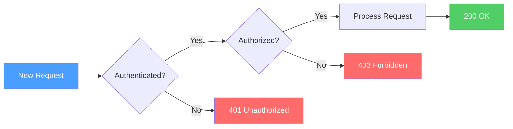

Key syntax:
- `LR` = left to right, `TB` = top to bottom
- `[text]` = rectangle, `{text}` = diamond (decision), `([text])` = stadium, `((text))` = circle
- `-->` = arrow, `-->|label|` = labeled arrow, `---` = line without arrow

### Subgraphs

Group related nodes into labeled boxes with `subgraph`. Useful for showing system boundaries, environments, or logical groupings.

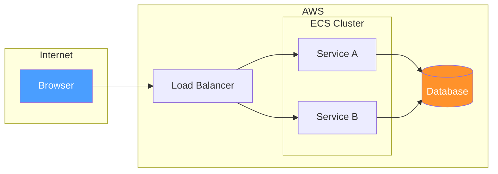

### Node Shapes

Mermaid supports a variety of node shapes beyond the basics:

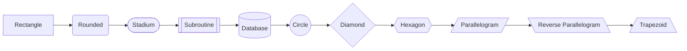

### Top-to-Bottom Layout

Swap `LR` for `TB` when vertical flow reads more naturally — like pipelines, waterfalls, or anything with a clear top-down progression.

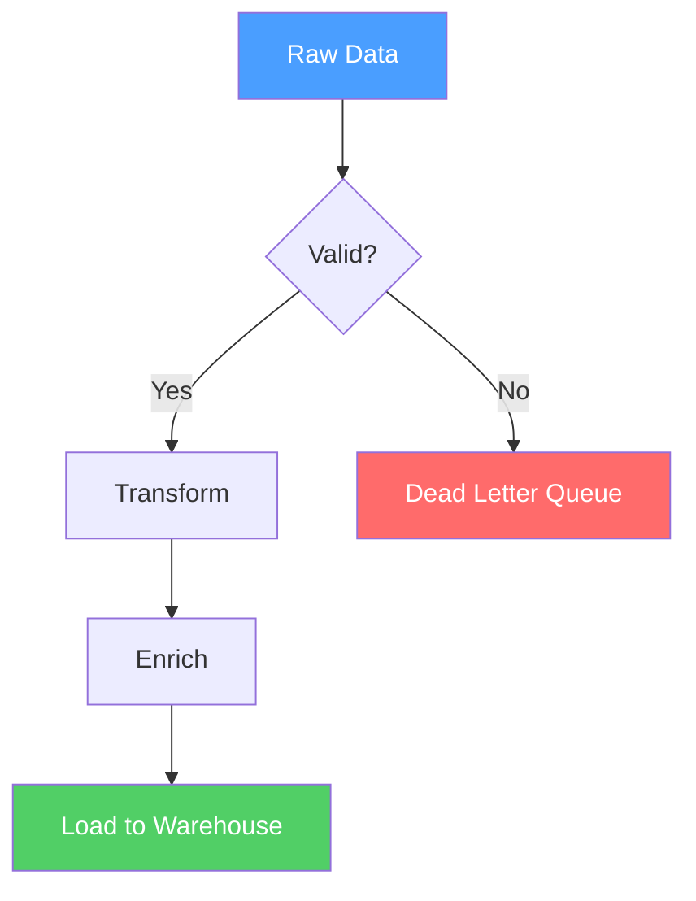

---

## Sequence Diagram

**When to use it:** API calls, service-to-service interactions, anything where the order of messages between participants matters.

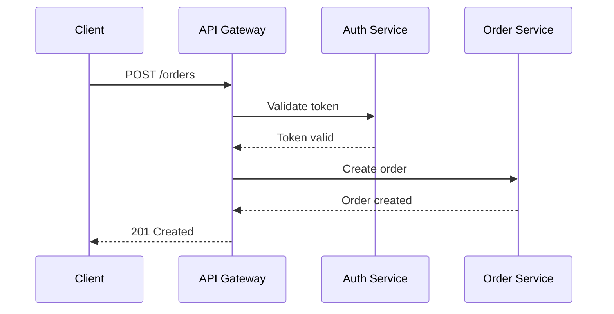

Key syntax:
- `->>` = solid arrow (request), `-->>` = dashed arrow (response)
- `participant X as Label` = alias a participant
- `Note over A,B: text` = add a note spanning participants
- `alt` / `else` / `end` = conditional blocks
- `loop` / `end` = loops

---

## Class Diagram

**When to use it:** Data models, OOP relationships, struct/trait hierarchies. Good for documenting the shape of your domain objects.

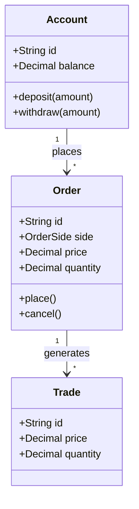

Key syntax:
- `+` = public, `-` = private, `#` = protected
- `<|--` = inheritance, `*--` = composition, `o--` = aggregation, `-->` = association
- `"1" --> "*"` = multiplicity labels

---

## State Diagram

**When to use it:** State machines, lifecycle management, anything with well-defined states and transitions.

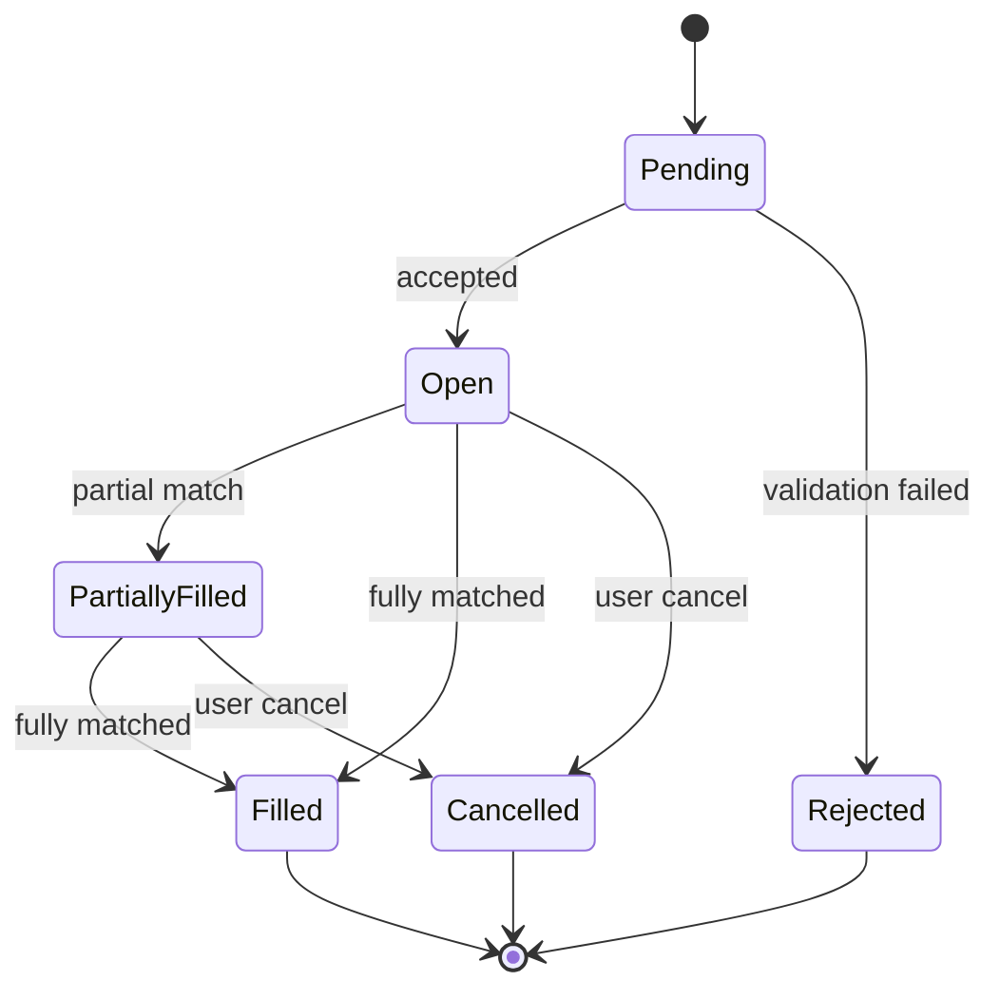

Key syntax:
- `[*]` = start/end state
- `-->` = transition, `State1 --> State2 : event` = labeled transition
- `state "Description" as S1` = named state alias
- Supports nested states with `state Parent { ... }`

---

## Entity Relationship Diagram

**When to use it:** Database schemas, table relationships, data modeling.

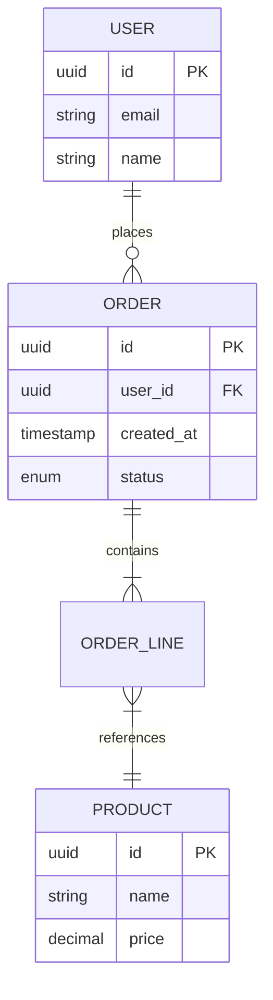

Key syntax:
- `||--o{` = one to zero-or-many, `||--|{` = one to one-or-many
- `}|--||` = many to one
- `PK` = primary key, `FK` = foreign key

---

## Gantt Chart

**When to use it:** Project timelines, sprint planning, any schedule-based visualization.

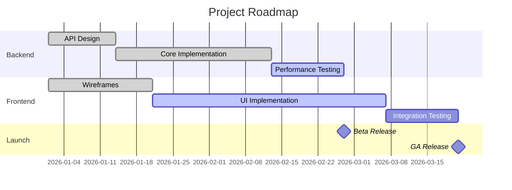

Key syntax:
- `done`, `active`, `crit` = task status/style modifiers
- `after taskid` = dependency
- `milestone` = zero-duration milestone marker
- `30d` = duration, or use an end date

---

## Pie Chart

**When to use it:** Proportional data, distribution breakdowns, quick "share of total" visualizations.

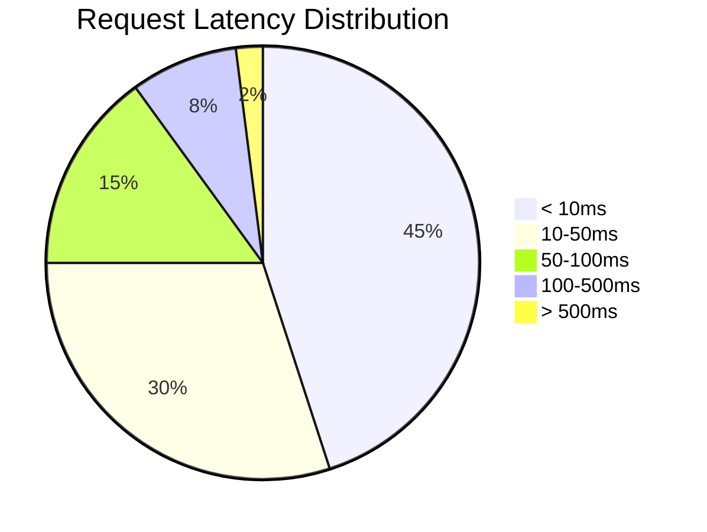

Key syntax:
- `pie title Title` = chart with title
- `"Label" : value` = each slice

---

## Quadrant Chart

**When to use it:** Priority matrices, effort-vs-impact analysis, any 2D comparison where you want to bucket items into four categories.

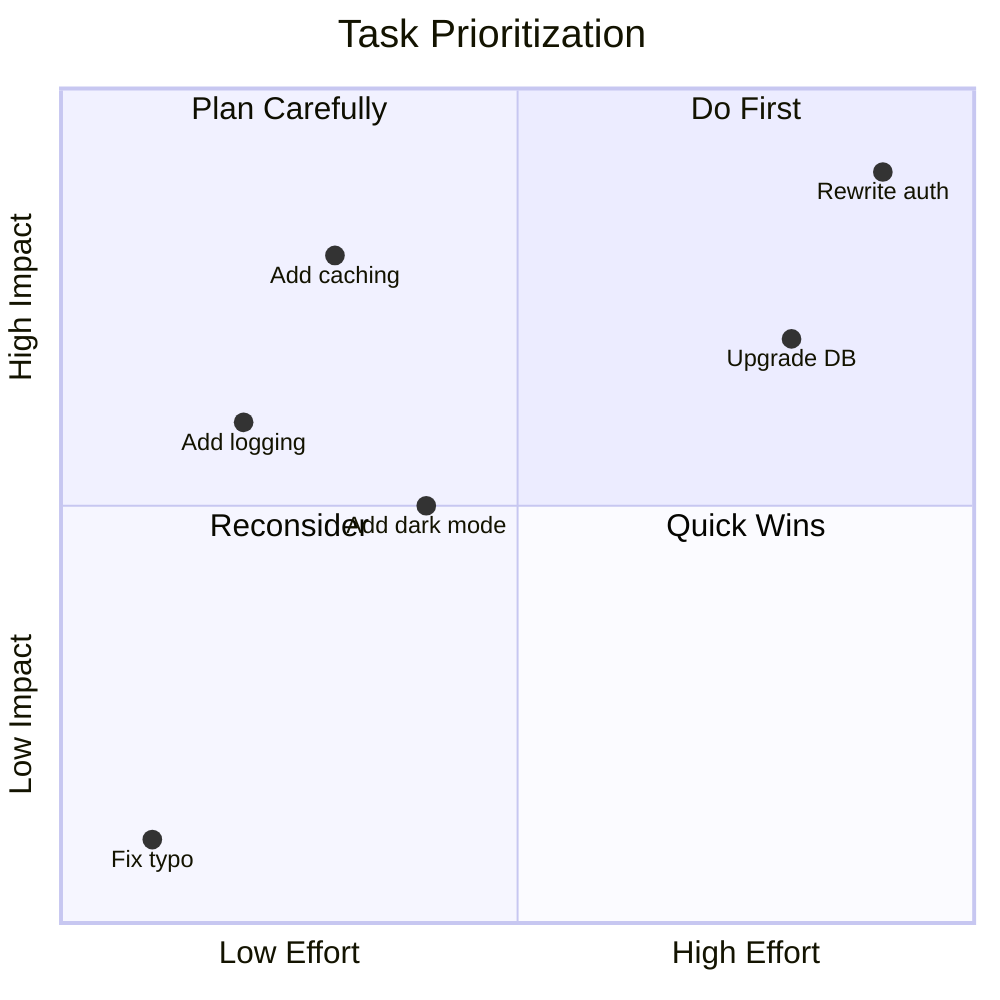

Key syntax:
- `x-axis Low --> High` = axis labels
- `quadrant-1` through `quadrant-4` = quadrant labels (1 = top-right, 2 = top-left, 3 = bottom-left, 4 = bottom-right)
- `Item: [x, y]` = data points (0 to 1)

---

## XY Chart

**When to use it:** Bar charts, line charts, any data where you want to plot values against categories or a numeric axis.

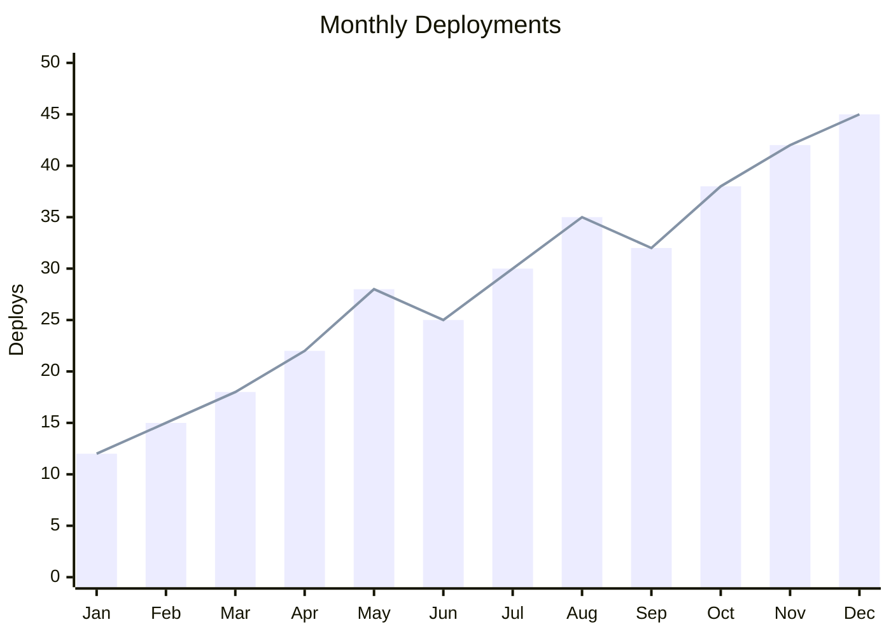

Key syntax:
- `x-axis [A, B, C]` = categorical axis
- `y-axis "Label" min --> max` = numeric axis with range
- `bar [...]` and `line [...]` = data series

---

## Timeline

**When to use it:** Chronological events, historical progressions, release histories.

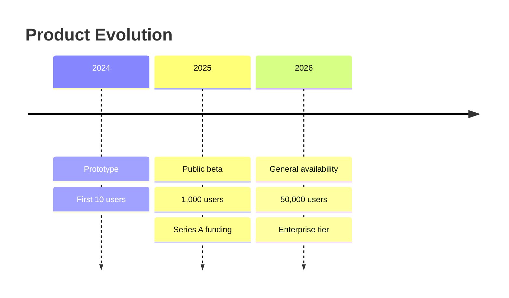

Key syntax:
- `title` = chart title
- `period : event` = first event in a period
- `: event` (indented) = additional events in the same period

---

## Mind Map

**When to use it:** Brainstorming, topic hierarchies, organizing related concepts.

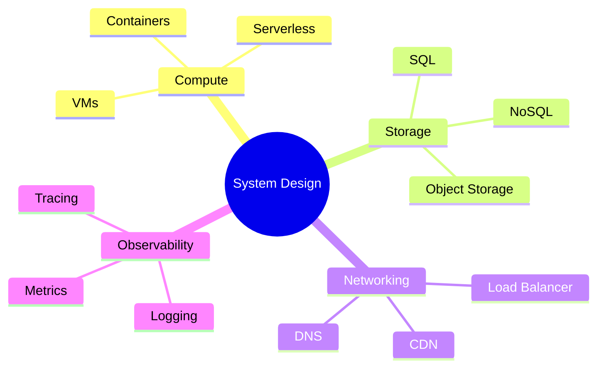

Key syntax:
- `root((text))` = root node (circle)
- Indentation defines hierarchy
- Node shapes: `(text)` = rounded, `[text]` = square, `((text))` = circle, `)text(` = bang

---

## Git Graph

**When to use it:** Branch/merge strategies, git workflow documentation, visualizing release processes.

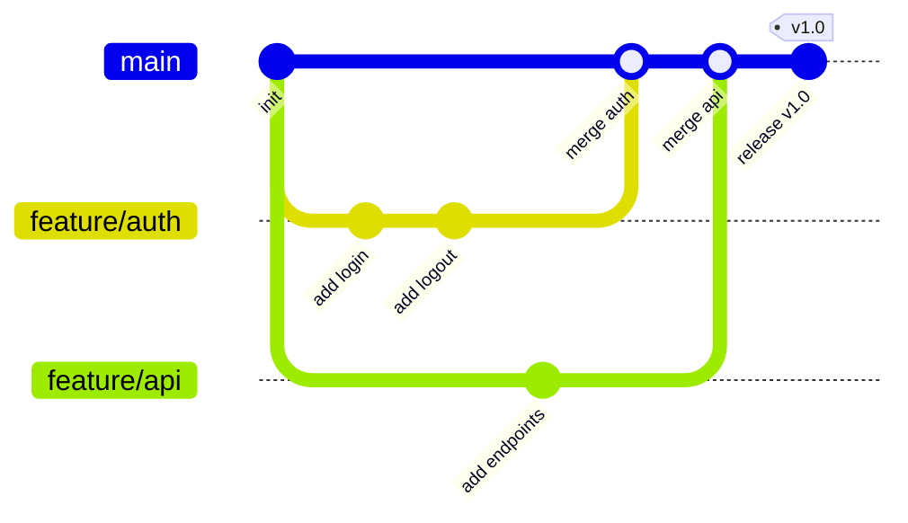

Key syntax:
- `commit id: "msg"` = commit with label
- `branch name` = create branch, `checkout name` = switch to branch
- `merge branch` = merge branch into current
- `tag: "v1.0"` = add a tag to a commit

---

## References

- [Mermaid Documentation](https://mermaid.js.org/intro/) — official docs, the definitive syntax reference
- [Mermaid Live Editor](https://mermaid.live/) — browser-based editor with instant preview, great for prototyping
- [Mermaid Syntax Cheat Sheet](https://mermaid.js.org/ecosystem/tutorials.html) — official tutorials and examples
