# TigerBeetle

We're building a Central Limit Order Book (CLOB) exchange. At the heart of every exchange is a component that answers one question: **"Does this user have enough money to place this order?"**

That component — our risk engine — needs to track balances, reserve funds when orders are placed, release funds when orders are cancelled, and settle trades when orders match. Every one of these operations is a balance mutation. And every balance mutation must be **correct** — no negative balances, no money created from thin air, no double-spending.

We started looking at [TigerBeetle](https://docs.tigerbeetle.com/) because it's a database purpose-built for exactly this kind of financial record-keeping. The question was: could it handle our balance accounting?

The answer turned out to be nuanced — **not for the risk engine, but perfect for our settlement layer**. Along the way, I developed a deep appreciation for TigerBeetle's design. This post shares what I learned.

---

## What Is TigerBeetle?

TigerBeetle is a **financial transactions database**. Not a general-purpose database. Not a key-value store. Not a message queue. It does one thing: track how money moves between accounts.

Think of it as a database that has the rules of double-entry bookkeeping burned into its DNA. You can't violate those rules even if you try — the database won't let you.

### The Entire Data Model: Three Things

TigerBeetle's data model consists of exactly three concepts:


That's it. No tables, no schemas, no SQL. Just:

1. **Accounts** — who has how much
2. **Transfers** — how value moved from one account to another
3. **Ledgers** — what kind of value (USD, BTC, gold, loyalty points, etc.)

Let's understand each one.

---

## Accounts: Not What You Think

In most databases, a "balance" is a single number:

```
Alice: $100
```

TigerBeetle doesn't store a single "balance" number. Instead, it stores **four cumulative counters** per account — and your application derives the balance from them:

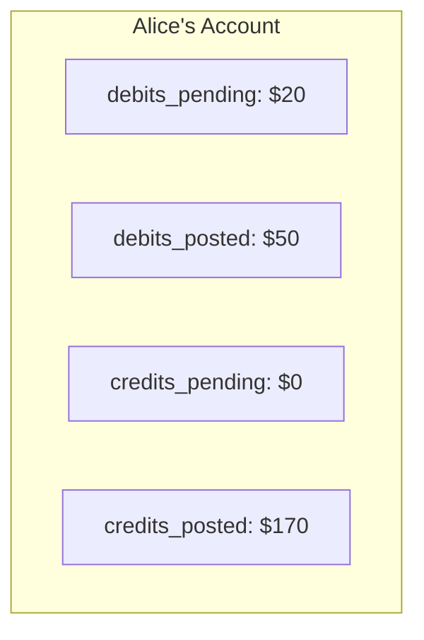

| Counter | Meaning |
|---------|---------|
| `credits_posted` | Total confirmed incoming value (all time) |
| `debits_posted` | Total confirmed outgoing value (all time) |
| `credits_pending` | Incoming value reserved but not yet finalized |
| `debits_pending` | Outgoing value reserved but not yet finalized |

These four counters are **real, persisted fields** on the account record — TigerBeetle updates them automatically whenever a transfer affects the account. But the single "balance" number you'd show to a user? **That's derived by your application**, not stored by TigerBeetle:

```
Available balance = (credits_posted - debits_posted) - debits_pending
                  = ($170 - $50) - $20
                  = $100
```

### Why Four Counters Instead of One?

A single `balance` field can't distinguish between:
- "Alice has $100 with nothing in flight"
- "Alice has $200 with $100 reserved for a pending order"

Both show `balance = $100`, but they represent very different states. With four counters, the full picture is always visible — both the confirmed state and the in-flight state.

### Balance Constraints: Non-Negativity at the Database Level

Each account can set a flag:

- **`credits_must_not_exceed_debits`** — the account can never go below zero (debit balance). Use this for user wallets.
- **`debits_must_not_exceed_credits`** — the inverse. Use this for liability accounts.

When this flag is set, TigerBeetle **rejects any transfer** that would violate the constraint. You don't write `if balance < amount { return error }` in your application code — the database enforces it.

---

## Transfers: One Debit, One Credit, Same Amount

A transfer is the simplest possible primitive:

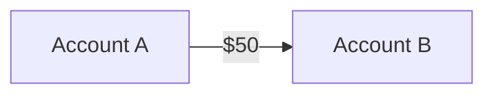

Every transfer:
- Debits **exactly one** account
- Credits **exactly one** account
- By the **same amount**
- On the **same ledger**

No multi-account transactions. No partial amounts. No conditional logic. Just one debit, one credit.

### But What About Complex Operations?

Real-world financial operations involve multiple accounts. A trade debits the seller, credits the buyer, and collects fees. TigerBeetle handles this through **linked transfers** — a chain of simple transfers that succeed or fail atomically:

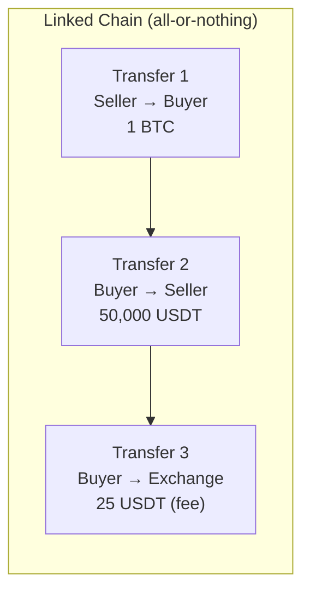

If any transfer in the chain fails (e.g., the buyer doesn't have enough USDT), **all of them fail**. No partial state. No cleanup needed.

### Two-Phase Transfers: Reservations Built Into the Database

Many financial operations happen in two stages: first you reserve the funds, then you finalize (or cancel). TigerBeetle supports this natively:

**Phase 1 — Pending:** Reserve funds. The amount moves to `debits_pending`/`credits_pending`. Posted balances are untouched.

**Phase 2 — Resolve:** Either:
- **Post** — finalize the transfer (pending → posted)
- **Void** — cancel the reservation (funds return to original account)
- **Timeout** — automatic cancellation after a configurable interval

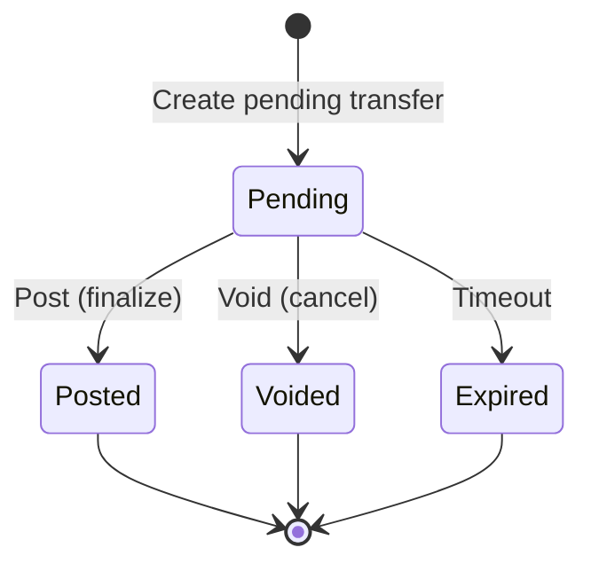

This eliminates the need for application-level reservation tracking. The database knows what's reserved, what's confirmed, and what's expired.

### Immutability

Transfers cannot be modified or deleted. Ever. Posting a pending transfer doesn't modify the original — it creates a **new** transfer that references the original. To correct a mistake, you create a corrective transfer (a reversal), just like real-world accounting.

---

## Ledgers: Keeping Apples and Oranges Separate

A ledger is just a number — a tag on every account and transfer. It partitions the account space:

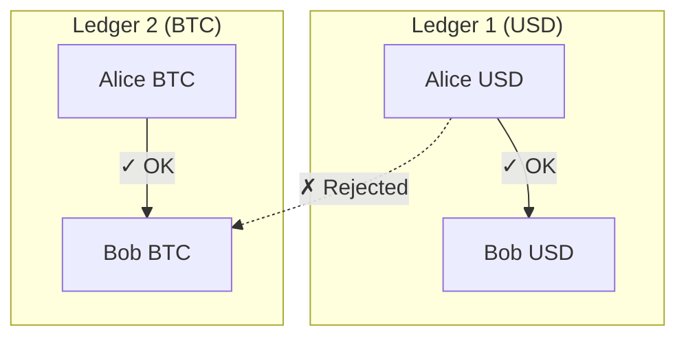

**Only accounts on the same ledger can transact directly.** You can't debit USD from one account and credit BTC to another in a single transfer — that would be adding apples to oranges. TigerBeetle enforces this structurally.

Cross-ledger operations (like a currency exchange) use **linked transfers** — one transfer per ledger, linked atomically.

---

## Primitives

TigerBeetle's thesis: **all financial state can be expressed as accounts, transfers, and ledgers.**

Think about it:
- **State** is balances → accounts (who + how much) × ledgers (of what)
- **Transitions** are value moving → transfers (always from somewhere to somewhere)
- **Constraints** are per-account → balance flags (non-negativity, caps)
- **Atomicity** is via linking → chain of transfers, all-or-nothing
- **Time** is via two-phase → pending transfers that resolve later

What about queries? Custom fields? Business logic? Those live in your application layer and your general-purpose database. TigerBeetle deliberately excludes them to stay minimal and correct.

This is the core design philosophy: **restrict the problem space so that correctness becomes structural.** A general-purpose database can represent any schema, which means it can represent an incorrect schema. TigerBeetle can only represent double-entry bookkeeping, which means conservation of value is guaranteed by construction.

---

## Examples

### Simple Payment

Alice pays Bob $30.

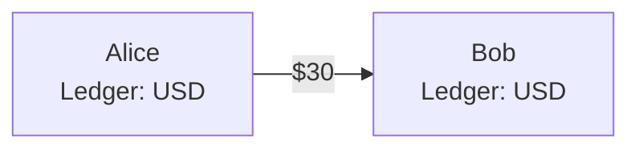

**One transfer:**

| Field | Value |
|-------|-------|
| debit_account | Alice |
| credit_account | Bob |
| amount | 3000 (cents, scale=2) |
| ledger | 1 (USD) |
| code | 1 (payment) |

**Before:**

```
Alice:  credits_posted=10000  debits_posted=0     → balance: $100
Bob:    credits_posted=5000   debits_posted=0     → balance: $50
```

**After:**

```
Alice:  credits_posted=10000  debits_posted=3000  → balance: $70
Bob:    credits_posted=8000   debits_posted=0     → balance: $80
```

Total system balance: `$150` before, `$150` after. Conservation guaranteed.

If Alice only had $20, and her account has the `credits_must_not_exceed_debits` flag, TigerBeetle rejects the transfer — `debits_posted` (3000) would exceed `credits_posted` (2000).

---

### Hotel Hold (Two-Phase Transfer)

A hotel charges `$200`/night but doesn't know the final amount until checkout (minibar, room service, etc.). They place a **hold** for `$250` at check-in, then finalize the actual amount at checkout.

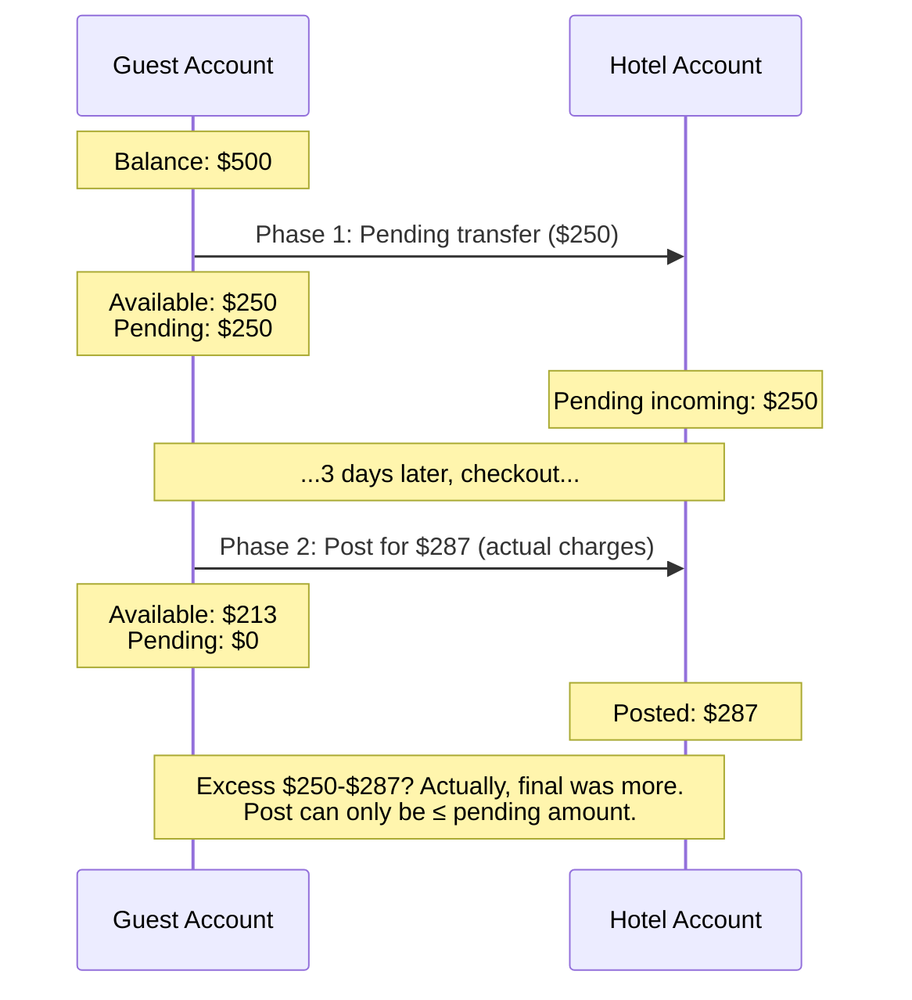

Wait — what if the actual charges `$287` exceed the hold `$250`?

TigerBeetle enforces that the posted amount cannot exceed the pending amount. The hotel would need to **post the full $250** and create a **separate transfer for $37**. This mirrors real-world payment processing — a hold is a maximum, not a minimum.

Let's trace the correct flow:

**Check-in: Create pending transfer**

| Field | Value |
|-------|-------|
| id | 1001 |
| debit_account | Guest |
| credit_account | Hotel |
| amount | 25000 (cents) |
| flags | `pending` |
| timeout | 259200 (3 days, in seconds) |

Guest's account now shows:
```
debits_pending: 25000    → $250 reserved
debits_posted:  0
Available: $500 - $250 = $250
```

**Checkout (final bill = $220): Post pending transfer**

| Field | Value |
|-------|-------|
| id | 1002 |
| pending_id | 1001 |
| amount | 22000 (cents) |
| flags | `post_pending_transfer` |

This posts `$220` and automatically releases the remaining `$30` hold. Guest's account:
```
debits_pending: 0        → hold released
debits_posted:  22000    → $220 charged
Available: $500 - $220 = $280
```

**If the guest cancels: Void pending transfer**

| Field | Value |
|-------|-------|
| id | 1003 |
| pending_id | 1001 |
| flags | `void_pending_transfer` |

Entire `$250` hold is released. Guest's account returns to `$500` available.

**If the guest disappears: Timeout**

After 3 days (the `timeout` value), TigerBeetle automatically voids the pending transfer. No application code needed.

---

### Spot Trade on an Exchange (Linked + Two-Phase)

Alice wants to buy 1 BTC at $50,000 from Bob. The exchange charges a 0.1% taker fee.

This is the most complex example because it involves:
- Two assets (USD and BTC) on different ledgers
- A reservation phase (order placed) and a settlement phase (order matched)
- Fee collection
- Atomicity (all legs succeed or all fail)

**The accounts:**

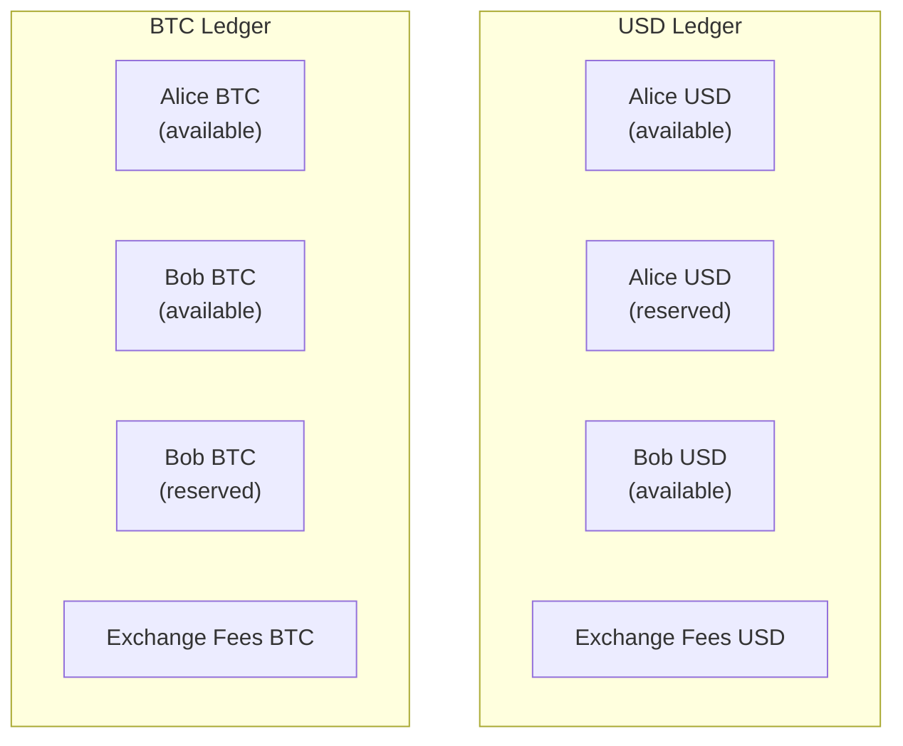

**Step 1: Alice places a buy order — reserve $50,050 USD**

(50,000 + 50 fee buffer at 0.1%)

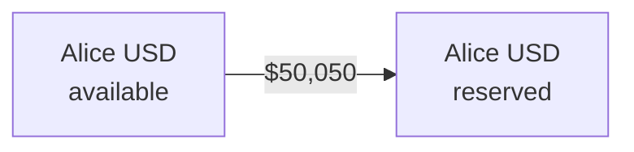

One transfer: Alice.available.USD → Alice.reserved.USD, amount = 50,050.

**Step 2: Bob places a sell order — reserve 1 BTC**

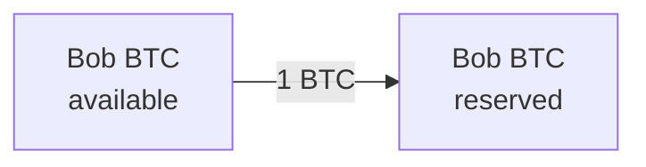

One transfer: Bob.available.BTC → Bob.reserved.BTC, amount = 1 BTC.

**Step 3: Orders match — settle the trade**

The exchange engine matches Alice and Bob. Now we need to atomically:
1. Move USD from Alice's reserved to Bob's available
2. Move BTC from Bob's reserved to Alice's available
3. Collect the fee
4. Return Alice's excess fee buffer

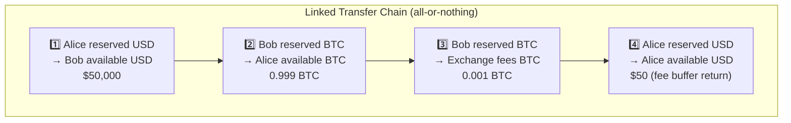

These four transfers are **linked** — all succeed or all fail:

| # | Debit Account | Credit Account | Amount | Ledger | Flags |
|---|--------------|----------------|--------|--------|-------|
| 1 | Alice.reserved.USD | Bob.available.USD | 50,000 | USD | `linked` |
| 2 | Bob.reserved.BTC | Alice.available.BTC | 0.999 BTC | BTC | `linked` |
| 3 | Bob.reserved.BTC | Exchange.fees.BTC | 0.001 BTC | BTC | `linked` |
| 4 | Alice.reserved.USD | Alice.available.USD | 50 | USD | *(end of chain)* |

**After settlement:**

| Account | Before | After | Change |
|---------|--------|-------|--------|
| Alice USD (available) | $100,000 | $49,950 | -$50,050 reserved, +$50 returned |
| Alice BTC (available) | 0 | 0.999 BTC | +0.999 BTC |
| Bob USD (available) | $0 | $50,000 | +$50,000 |
| Bob BTC (available) | 5 BTC | 4 BTC | -1 BTC reserved |
| Exchange fees BTC | 0 | 0.001 BTC | +0.001 BTC |

**Conservation check:**
- Total USD: $100,000 before, $100,000 after (Alice $49,950 + Bob $50,000 + Exchange $0 + Alice reserved $0). Conserved.
- Total BTC: 5 BTC before, 5 BTC after (Alice 0.999 + Bob 4 + Exchange 0.001). Conserved.

No money created. No money destroyed. Guaranteed by the data model.

---

## Why TigerBeetle is not for Our Risk Engine

TigerBeetle's batching model is excellent — and our risk engine also uses batched writes to its own write-ahead log (WAL), so the throughput characteristics could work. But two fundamental problems ruled it out:

**1. The risk engine manages far more state than just balances.**

Financial accounting — available balances, reserved balances, pending withdrawals — is only one part of what the risk engine tracks. It also maintains order reservations with rich metadata (price, quantity, fee buffers, order parameters), deduplication caches, fee tier configurations, symbol risk limits, and account status. All of this state must be durably logged so the engine can recover from a crash.

TigerBeetle's fixed schema (accounts + transfers, with 28 bytes of user data) can only cover the balance accounting portion. Everything else still needs our own WAL. Since we can't eliminate the WAL by adopting TigerBeetle, we'd be adding a second durable write on the critical path — TigerBeetle on top of the WAL we already have. That's two layers of expensive persistence for every operation, with no way to remove either one.

**2. By the time TigerBeetle could validate a settlement, it's too late to act on a rejection.**

The risk engine settles trades *after* the matching engine has already executed them. The order lifecycle looks like this:

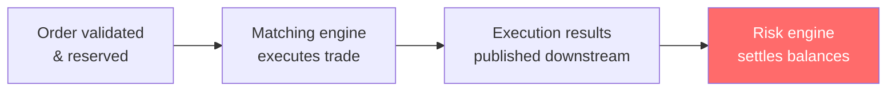

If TigerBeetle were involved at the settlement phase (step 4) and rejected a balance mutation, the trade has already been executed and the execution results have already been published to downstream consumers. There's no easy or obvious way to revert a matched trade or retract a published execution stream. TigerBeetle would detect the problem, but we'd have no clean way to fix it — making it a monitoring tool, not a prevention tool, in this position.

## Where TigerBeetle Shines: The Settlement Layer

Our on-chain settlement layer is a different story. It sits at the very end of the pipeline — collecting balance changes, aggregating them into batches, and submitting them to the blockchain. The key difference: **the irreversible action (on-chain submission) hasn't happened yet.**

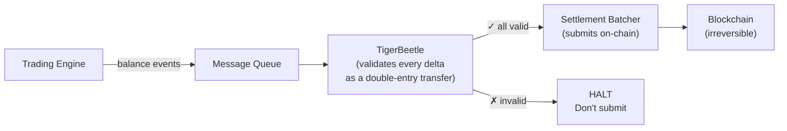

Every balance delta must pass through TigerBeetle before reaching the blockchain. If a delta would violate conservation or produce a negative balance, TigerBeetle rejects it — and the invalid batch never reaches the chain.

This is the critical difference: **in the risk engine, TigerBeetle can only detect bugs after the damage is done. In the settlement layer, TigerBeetle can prevent bugs before they become irreversible.** That's where it delivers the most value.

---

## TigerBeetle's Design Philosophy (Why We Admire It)

**"Double-entry bookkeeping is a beautiful schema for this domain."** Most financial systems implement accounting rules in application code on top of a general-purpose database. TigerBeetle bakes the rules into the database itself. You can't violate conservation because the data model doesn't allow it.

**"Safety and performance are not at odds."** By restricting the problem space to accounts and transfers, TigerBeetle can use single-threaded serial execution (no locks, no conflicts, no isolation anomalies) and batch aggressively. It achieves millions of TPS while maintaining the strictest isolation level (strict serializability).

**Immutability is the feature, not the limitation.** Financial records shouldn't change. TigerBeetle enforces this — no updates, no deletes, only appends. Corrections are new transfers, just like in real-world accounting. This makes the audit trail complete and tamper-resistant by construction.

**Fixed schema as a strength.** By refusing to be a general-purpose database, TigerBeetle can optimize every byte, every disk write, every network round-trip for the one thing it does. It's a purpose-built machine for financial integrity.

---

## Key Takeaways

1. **TigerBeetle is not a general-purpose database.** It's a financial transactions engine with a fixed schema: accounts, transfers, ledgers. If your problem is "track how value moves between entities," it's worth evaluating.

2. **The data model is the invariant.** Conservation, non-negativity, and double-entry correctness are structural properties of the data model — not runtime checks that your application code might forget.

3. **Know where latency matters.** TigerBeetle excels at high-throughput batch processing, not single-operation microsecond latency. Put it where correctness matters more than speed — like before an irreversible on-chain settlement.

4. **Three primitives are sufficient.** Accounts (who has how much), transfers (how it moved), ledgers (what kind of value). Every financial operation decomposes into these.

---

## TigerBeetle Official Resources

- [TigerBeetle Home](https://tigerbeetle.com/)
- [Documentation](https://docs.tigerbeetle.com/)
- [Data Modeling Guide](https://docs.tigerbeetle.com/coding/data-modeling/)
- [System Architecture — TigerBeetle in Your Stack](https://docs.tigerbeetle.com/coding/system-architecture/)
- [Two-Phase Transfers](https://docs.tigerbeetle.com/coding/two-phase-transfers/)
- [Linked Events (Atomic Chains)](https://docs.tigerbeetle.com/coding/linked-events/)
- [Financial Accounting Concepts](https://docs.tigerbeetle.com/coding/financial-accounting/)
- [Safety Guarantees](https://docs.tigerbeetle.com/concepts/safety/)
- [Recipes (Currency Exchange, Balance Bounds, etc.)](https://docs.tigerbeetle.com/coding/recipes/)
- [GitHub Repository](https://github.com/tigerbeetle/tigerbeetle)
